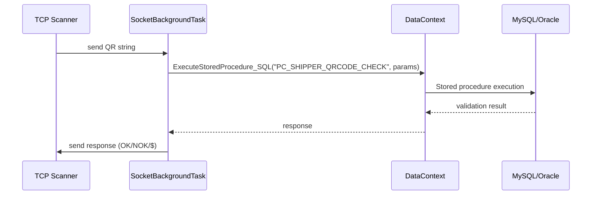
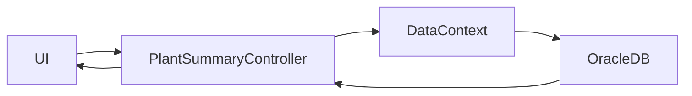

# DispatchSystem — Repository Overview

This document provides a cross-cutting overview of the DispatchSystem repository from three perspectives: Software Architect, Software Developer, and Product Manager. It contains system architecture diagrams, key components, primary flows, setup notes, and actionable recommendations.

> Project type: ASP.NET Core web application with MVC/Razor views and background socket services. Target: .NET 6.

## Table of contents
- Project summary
- High-level architecture (Mermaid)
- Component breakdown
- Key flows (Mermaid)
- Developer notes (structure & maintainability)
- Product Manager notes (features & UX)
- Actionable recommendations & questions
- Getting started (local)
- Key files & search keywords


## Project summary

DispatchSystem is a web application for managing MDA dispatch operations, QR code generation/validation, gate in/out flows, weighment, and reporting. The system includes:

- Area-based web UI (Admin, Dispatch, Export, Vendor, MDA_Automation, etc.)
- A centralized `DataContext` that executes stored procedures against Oracle and MySQL
- Background TCP socket services for receiving QR scan data and communicating with hardware
- Sync components to push local changes to cloud systems
- SignalR integration for conveyor/real-time notifications


## High-level architecture

```mermaid
graph LR
  Browser[Browser / User]
  WebApp[ASP.NET Core Web App\n(Controllers + Razor Views)]
  SocketSvc[SocketBackgroundTask\n(TCP Listener)]
  ConveyorSvc[ConveyorBackgroundTask / SignalR]
  SyncBatch[CL_SyncBatch Service]
  OracleDB[(Oracle DB)]
  MySQLDB[(MySQL / Local DB)]
  API[External APIs]

  Browser -->|HTTP(S)| WebApp
  WebApp -->|Stored procedures| OracleDB
  WebApp -->|Stored procedures| MySQLDB
  SocketSvc -->|TCP| WebApp
  SocketSvc -->|SP calls| MySQLDB
  ConveyorSvc -->|SignalR| WebApp
  WebApp -->|Background sync| SyncBatch
  WebApp -->|HTTP| API

  subgraph Background
    SocketSvc
    ConveyorSvc
    SyncBatch
  end
```


## Component breakdown

- `DispatchSystem` (web project)
  - Organized using ASP.NET MVC areas (Admin, Dispatch, Export, Vendor, MDA_Automation, LineMaster)
  - Controllers call stored procedures directly via `DataContext` and map `DataRow` to DTOs
- `Infra/DataContext.cs`
  - Static API to execute queries and stored procedures for Oracle and MySQL (many methods)
  - Contains sync helpers to move local data to cloud
- `Infra/SocketBackgroundTask.cs`
  - Long-running TCP listener that processes QR scan strings and uses stored procedures for validation
  - Updates in-memory shared data structures and replies to clients
- `Infra/ConveyorBackgroundTask.cs` and `Infra/ConveyorHub.cs`
  - SignalR based real-time updates and conveyor integration
- `Infra/LogService.cs`, `Infra/Common.cs`, `AppHttpContextAccessor`
  - Cross-cutting utilities for logging, config, session helpers


## Key flows

1) QR Scanning / Loading workflow



2) Plant summary / reporting




## Developer notes (structure & maintainability)

- Strengths
  - Clear modular areas and controllers
  - Centralized DB helpers reduce duplicated connection code
  - Background services use DI and are registered in `Program.cs`

- Issues / Technical debt
  - `DataContext` is a large static class with many responsibilities — hard to unit test and to mock
  - Controllers frequently assemble `OracleParameter`/`MySqlParameter` lists inline; this causes repetition and makes refactoring error-prone
  - No repository or query abstraction: moving to Dapper or minimal repository interfaces would improve readability
  - Background socket logic performs low-level socket management; using `IHostedService` with clean start/stop and cancellation will improve robustness
  - Error handling logs exceptions but user-facing errors are limited or inconsistent


## Product Manager notes (features & UX)

- Core features observed
  - MDA dispatch reporting, MDA-wise summaries, shipper QR check/validation, weighment slips, gate in/out operations
  - Admin/Vendor role separation
  - Print-friendly partial views and templates for labels and slips

- UX / business recommendations
  - Add an operations dashboard showing socket health, backlog, and sync status
  - Surface clearer error and retry guidance when scanner or sync operations fail
  - Consider saved report filters and scheduled exports for frequent reporting


## Actionable recommendations & questions

- Engineering
  - Refactor `DataContext` into an interface-backed service (`IDbExecutor`) to enable DI and easier testing
  - Create small DTO mappers (DataRow -> model) to reduce duplication in controllers
  - Replace raw socket handling with a hosted service wrapper implementing `IHostedService` and graceful shutdown
  - Add health checks, logging metrics, and alerts for socket and sync components

- Product / Roadmap
  - Add monitoring page for scanner connections and sync status
  - Define RPO/RTO requirements for sync and scanner processing to guide infrastructure choices

- Questions to clarify
  1. Which DB (Oracle or MySQL) is primary for each functional area? Is a migration planned?
  2. Is the socket-based scanner integration mission-critical and required to be highly available?
  3. Are there SLAs for how quickly local data must be synced to cloud systems?


## Getting started (local)

1. Ensure .NET 6 SDK is installed.
2. Configure environment or `appsettings.json` expected values used by `AppHttpContextAccessor` (DB connection strings, `Listen_IP`, `Listen_Port`, API URLs).
3. Run the app: `dotnet run --project DispatchSystem/DispatchSystem.csproj`.
4. For socket features, simulate TCP clients or configure a local scanner emulator to send QR strings to `Listen_IP:Listen_Port`.


## Key files & search keywords

- Startup: `Program.cs`
- DB helpers: `Infra/DataContext.cs`
- Background: `Infra/SocketBackgroundTask.cs`, `Infra/ConveyorBackgroundTask.cs`
- SignalR: `Infra/ConveyorHub.cs`
- Areas: `Areas/Admin`, `Areas/Dispatch`, `Areas/Export`, `Areas/Vendor`, `Areas/MDA_Automation`
- Search keywords: `ExecuteStoredProcedure_DataTable`, `PC_PLANT_SUMMARY_REPORT`, `PC_SHIPPER_QRCODE_CHECK`, `Listen_IP`, `Listen_Port`, `SyncData_LocalToCloud`


---

This README is intended to guide maintainers and stakeholders. I can follow up by creating a small PR that:

- Proposes an `IDbExecutor` interface and initial refactor scaffold
- Adds a basic health-check endpoint and a minimal operations dashboard
- Adds unit-test scaffolding for one controller with a mocked DB executor
